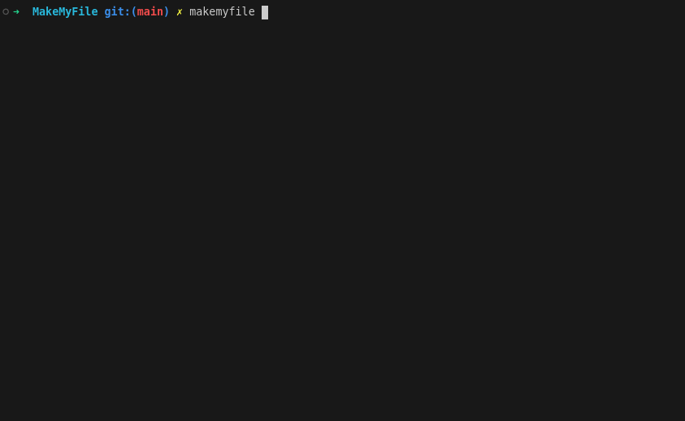

# Make My File
&nbsp;

### ⚠️ This project is in beta testing.
### Please report any bugs you find on Discord (@mrmilkshakes) or GitHub!
&nbsp;

**Make My File** is a fully automated Makefile generator for C projects, optimized for 42 school.

Run the executable in your project directory and follow the prompts in the console GUI.

&nbsp;

## Features

- Auto-detect source files and headers, including in subdirectories.
- Detect C project structure and Create project structure automatically if not present, including:
	- main.c, name-app.c, and name-app.h
	- Directories: include/ and src/
	- A corresponding Makefile
	- A .gitignore file for c project

- Option to include bonus files for projects 42.
- Create object directories and dependency files.
- Link against the `ft_libft` library (42).
- 'Regen' rule in the generated Makefile for updates.

&nbsp;

## Disclaimer

While **Make My File** automates Makefile generation, knowing how to create one manually is essential, especially during 42 school pool sessions.


&nbsp;

## Installation

1. Run the installer script: (Note: This does not work on Windows; please install manually with releases panel.)
```bash
sudo bash -c "$(curl -L http://bit.ly/4eO4R1v)"
```

&nbsp;

2. To create a Makefile, navigate to the root of your project and run:
```bash
makemyfile
```

Tip: If you don’t have a project structure yet (meaning there are no .c files in the directory), the app will offer to create one for you. It's a great way to save time if you want to get started quickly!

&nbsp;

3. Follow the on-screen instructions.



&nbsp;

## Contributing

Contributions are welcome! Feel free to submit a pull request or open an issue for suggestions.

&nbsp;
