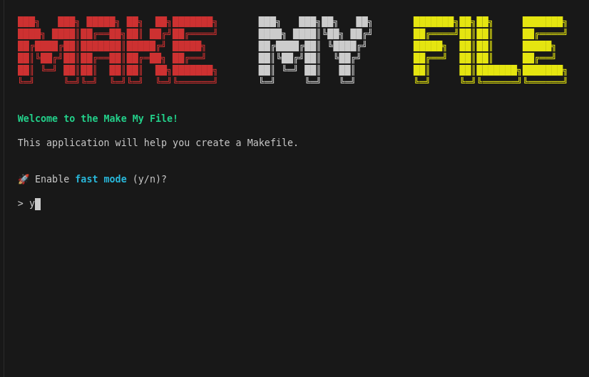
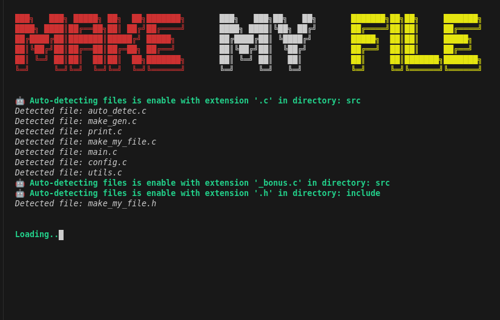

# Make My File - For project 42

**Make My File** is a fully automated Makefile generator for C projects, optimized for 42 school.

Run the executable in your project directory and follow the prompts in the console GUI.


&nbsp;

## Features

- Auto-detect source files and headers.
- Option to include bonus files for projects 42.
- Create object directories and dependency files.
- Link against the `ft_libft` library (42).

&nbsp;

## Disclaimer

While **Make My File** automates Makefile generation, knowing how to create one manually is essential, especially during 42 school pool sessions.


&nbsp;

## Installation

1. Clone the repository:
```bash
git clone https://github.com/MathysCogne/Make_My_File-42.git
```
2. Run the executable in your project directory:
```bash
./MakeMyFile
```
3. Follow the on-screen instructions.





&nbsp;

## Contributing

Contributions are welcome! Feel free to submit a pull request or open an issue for suggestions.

&nbsp;
